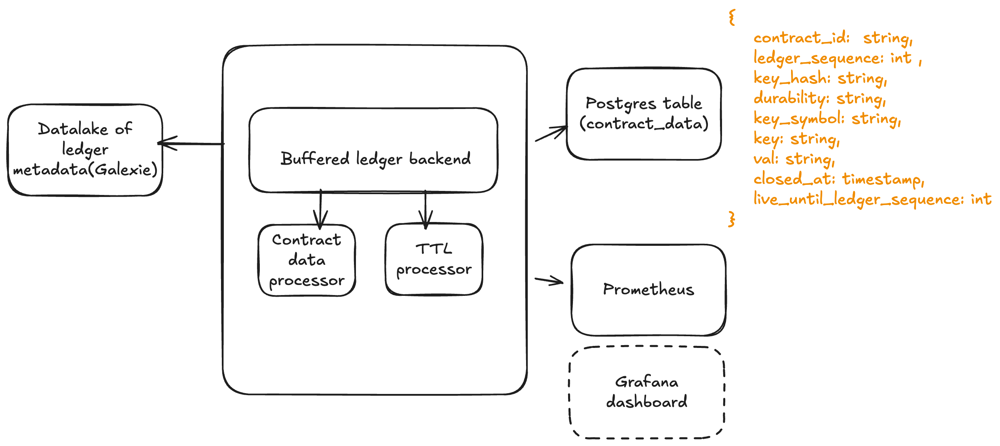

# stellar-ledger-data-indexer

Stellar Ledger Data Indexer is a light weight application that indexes contract data from Stellar ledger data. It can be extended to index other kinds of datasets.




# Install

## **Manual Installation**

1. Clone this repo `git clone https://github.com/stellar/stellar-ledger-data-indexer`
2. Build stellar-ledger-data-indexer with `go build`

```sh
$ ./stellar-ledger-data-indexer -config-file config.test.toml --start 58762521
## You can also use --end to specify end ledger to import
```

### Docker

1. Build the docker image locally with `make docker-build`
2. Run the docker container in interactive mode to run index commands.

```sh
$ docker run --platform linux/amd64 -it stellar/stellar-ledger-data-indexer:latest /bin/bash
```

### Testing

This tool has unit and integration test coverage.

```sh
go test -v -coverprofile=coverage.out -coverpkg=./... ./...
# To check coverage
go tool cover -func=coverage.out
```

_Note that integration tests extracts pubnet data from Galexie data lake_
Running integration tests requires:

- Having GCP credentials in the shell

```sh
gcloud auth login
gcloud config set project dev-hubble
gcloud auth application-default login
```

- Having a Postgres service running

### How it works

1. `ledgerMetaDataReader.go` reads raw XDR data from Galexie bucket.
2. `tranform` parses raw XDR data into JSON format and sends to postgres util.
3. `postgres` utils helps to write data to cloudsql instance.

### Configs

```
[datastore_config]
type = "GCS"

[datastore_config.params]
destination_bucket_path = "path/to/galexie/bucket

[datastore_config.schema]
ledgers_per_file = 1
files_per_partition = 64000

[stellar_core_config]
  network = "pubnet"

[postgres_config]
  host = "postgres"
  user = "postgres"
  database = "postgres"
  port = 5432
```
